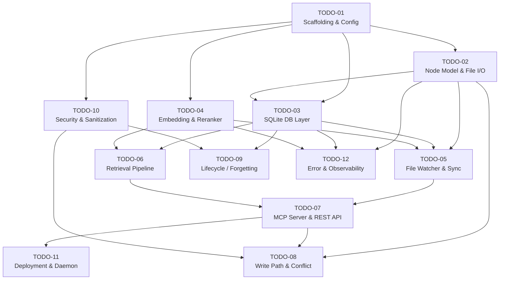

# Synapse — TODO Overview & Dependency Map

> 从 [agentic-hybrid-memory-architecture-design.md](../../agentic-hybrid-memory-architecture-design.md) 分解而来。  
> 每个 TODO 对应一个独立的 agent 任务。审核后逐个分配执行。

---

## TODO List

| # | TODO | Priority | Status | Design Doc Sections |
|---|------|----------|--------|-------------------|
| 01 | [Project Scaffolding & Configuration](TODO-01-project-scaffolding-and-configuration.md) | **P0** | COMPLETED | §4.2.2, §7.1.1, §9.3 |
| 02 | [Markdown Node Model & File I/O](TODO-02-markdown-node-model-and-file-io.md) | **P0** | COMPLETED | §3.1, §3.2 |
| 03 | [SQLite Database Layer](TODO-03-sqlite-database-layer.md) | **P0** | COMPLETED | §4.1, §4.2, §4.3 |
| 04 | [Embedding & Reranker Engine](TODO-04-embedding-and-reranker-engine.md) | **P0** | COMPLETED | §4.2.1, §4.2.2 |
| 05 | [File Watcher & Sync Loop](TODO-05-file-watcher-and-sync-loop.md) | **P1** | COMPLETED | §4.4, §4.5 |
| 06 | [Retrieval Pipeline (Hybrid Search + Rerank)](TODO-06-retrieval-pipeline.md) | **P0** | COMPLETED | §4.5, §5.1 |
| 07 | [MCP Server & REST API](TODO-07-mcp-server-and-rest-api.md) | **P0** | COMPLETED | §2, §4.2.2, §7.1.1 |
| 08 | [Write Path & Conflict Detection](TODO-08-write-path-and-conflict-detection.md) | **P1** | COMPLETED | §6, §5.4 |
| 09 | [Lifecycle Management (Forgetting)](TODO-09-lifecycle-management-forgetting.md) | **P1** | COMPLETED | §5 |
| 10 | [Security & Data Sanitization](TODO-10-security-and-data-sanitization.md) | **P1** | COMPLETED | §7 |
| 11 | [Deployment & OS Daemonization](TODO-11-deployment-and-daemonization.md) | **P2** | COMPLETED | §8 |
| 12 | [Error Handling, Resilience & Observability](TODO-12-error-handling-resilience-observability.md) | **P1** | COMPLETED | §9, §4.6 |

---

## Dependency Graph

---

## Recommended Execution Order

基于依赖关系，建议以下分 Phase 执行顺序：

### Phase 1: Foundation (可并行)
| TODO | Agent | 依赖 |
|------|-------|------|
| **TODO-01** — Scaffolding & Config | Agent A | None |

### Phase 2: Core Data Layer (在 Phase 1 完成后可并行)
| TODO | Agent | 依赖 |
|------|-------|------|
| **TODO-02** — Node Model & File I/O | Agent B | TODO-01 |
| **TODO-04** — Embedding & Reranker | Agent C | TODO-01 |
| **TODO-10** — Security & Sanitization | Agent D | TODO-01 |

### Phase 3: Index & Reliability Layer (需按顺序推进)
| TODO | Agent | 依赖 |
|------|-------|------|
| **TODO-03** — SQLite DB Layer | Agent E | TODO-01, 02 |
| **TODO-12** — Error & Observability | Agent F | TODO-01, 02, 03, 04（其中 delta sync / startup sync 与 TODO-05 最终对接） |

**执行说明**：先完成 `TODO-03`，再推进 `TODO-12`。原因是 `TODO-12` 的核心内容（`rebuild-index`、DB integrity check、WAL validation、health/status）直接依赖 SQLite 层；而其中与 file watcher 相关的 `delta sync` / `startup sync` 只需在 Phase 4 与 `TODO-05` 做最终集成收尾。

### Phase 4: Runtime Pipeline (推荐按顺序推进)
| TODO | Agent | 依赖 |
|------|-------|------|
| **TODO-06** — Retrieval Pipeline | Agent H | TODO-03, 04 |
| **TODO-05** — File Watcher & Sync | Agent G | TODO-02, 03, 04, 12（startup/delta sync hooks 最终对接） |

**执行说明**：推荐先完成 `TODO-06`，再推进 `TODO-05`。原因是 `TODO-06` 可以直接建立在 Phase 3 已完成的 SQLite / embedding / reranker 能力之上，先把稳定的读路径和排序语义固定下来；随后 `TODO-05` 再完成实时写入同步，并把 Phase 3 中已经预留的 `delta sync` / `startup sync` hooks 做最终落地。两者理论上可部分并行，但顺序推进更能减少对 `indexing.py`、`storage/sqlite.py` 和启动检查逻辑的交叉改动。

### Phase 5: Interface Layer (在 Phase 4 完成后)
| TODO | Agent | 依赖 |
|------|-------|------|
| **TODO-07** — MCP Server & REST API | Agent I | TODO-05, 06 |

### Phase 6: Application Logic (在 Phase 5 完成后可并行)
| TODO | Agent | 依赖 |
|------|-------|------|
| **TODO-08** — Write Path & Conflict | Agent J | TODO-02, 03, 04, 07, 10 |
| **TODO-09** — Lifecycle / Forgetting | Agent K | TODO-03, 05, 10 |
| **TODO-11** — Deployment & Daemon | Agent L | TODO-07 |

---

## Notes for Agents

1. **每个 TODO 文件是独立的任务规格书**，包含完整的上下文、依赖、和验收标准
2. **始终参考原始设计文档**的对应章节获取完整技术细节
3. **接口契约**：跨 TODO 的接口（如 `EmbeddingEngine`, `NodeStore`）在 TODO-01 中定义为抽象接口，实现方在各自 TODO 中完成
4. **测试**：每个 TODO 都应包含单元测试和必要的集成测试
5. **不要修改其他 TODO 的代码**——如果发现接口不兼容，在自己的 TODO 中记录并反馈
