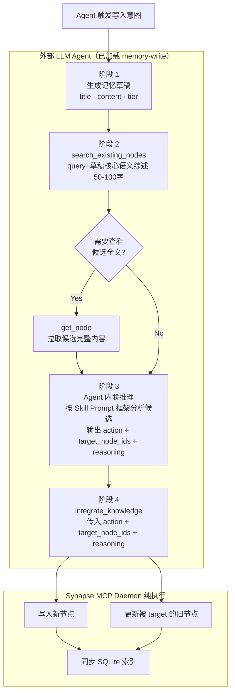

# External Memory Skills — 设计文档

> **文档状态**: 草稿，待审阅  
> **关联系统**: Synapse MCP Daemon（存储 / 检索后端）  
> **本文范围**: 仅描述外部 Skills 的职责边界、决策逻辑与调用协议。Synapse 内部实现不在此范围内。

---

## 1. 角色边界

```
┌──────────────────────────────────────────────────────────────┐
│         外部 LLM Agent（已加载 Memory Write / Lifecycle Skills） │
│                                                              │
│  ① 生成记忆草稿         ② 检索近似记忆                        │
│  ③ 内联分析候选 + 决策  ④ 调用 Synapse 执行                   │
│                                                              │
│  ✅ 负责：分析、判断、决策（Agent 自身推理，无需额外子代理）      │
│  ❌ 不负责：存储、索引、检索排序、lifecycle 管理                │
└─────────────────────────┬────────────────────────────────────┘
                          │  MCP Tool Calls
                          ▼
┌──────────────────────────────────────────────────────────────┐
│                    Synapse MCP Daemon                        │
│                                                              │
│   search_existing_nodes   integrate_knowledge                │
│   search_memory           update_node_status                 │
│   get_node                                                   │
│                                                              │
│  ✅ 负责：文件 I/O、SQLite 索引、embedding、rerank、decay      │
│  ❌ 不负责：任何内容判断逻辑                                   │
└──────────────────────────────────────────────────────────────┘
```

**Skill 的本质**：External Memory Skills 是一组加载到外部 LLM Agent 系统提示（system prompt）或任务描述中的**指令集**。它们不是代码，不是子代理，不调用额外的 LLM。它们描述的是：当 Agent 自身需要管理记忆时，**Agent 本身**应当如何思考、如何筛选候选、如何决策写入动作，以及如何参与更高层的生命周期整理。Agent 就是分析者，Skill 是 Agent 遵循的操作规程。

**核心原则**：Synapse 是纯执行层，不做任何推断。写入时用哪个 action、针对哪些 target node、某个旧节点是否应被 supersede，必须由外部 Agent（运行中的 LLM）在调用 `integrate_knowledge` 之前明确决定并传入。Synapse 只负责把这个已作出的决定落盘、更新状态、维护链接与 banner。

---

## 2. 推荐的 Skill 拆分

### 2.1 不单独做 Retrieval Skill

在当前架构下，**retrieval 默认不是一个独立 skill 问题，而是一个直接工具调用问题**。

当 Agent 需要历史上下文时，通常只需：

```
search_memory(query, top_k=3)
```

Synapse 已经在内部完成 FTS5 全文检索、向量召回、1-hop 图扩展、rerank、decay/status 惩罚与上下文组装。对外部 Agent 来说，读取路径的判断成本很低，因此不值得单独抽成一个 skill。

**结论**：retrieval 只需要一份很薄的共享 guideline，而不是独立 skill。

只有在未来出现以下复杂度时，才值得再考虑单独抽出 retrieval skill：
- query rewrite / query expansion
- 多阶段检索编排
- 多源路由（active / archive / disputed / namespace）
- 检索失败后的自动补救策略

### 2.2 `memory-write` Skill

`memory-write` 是当前最核心的外部 skill。它负责：

1. 判断一条信息**是否值得写入**
2. 决定写入 tier：`note` 或 `memory`
3. 生成规范草稿（`title` / `content` / 可选元数据）
4. 调用 `search_existing_nodes` / `get_node` 获取对比上下文
5. 决定 `create` / `supersede` / `complement`
6. 调用 `integrate_knowledge` 执行写入

> `note` / `memory` 是同一写入决策中的 tier 选择，不值得拆成两个独立 skill。否则会复制大部分判断逻辑。

### 2.3 `memory-lifecycle` Skill

`memory-lifecycle` 负责更高层的**周期性语义整理**，但不取代 Synapse 自带的机械生命周期能力。

边界如下：

- **Synapse janitor / condense**：负责机械扫描、归档、清理、候选集产生
- **memory-lifecycle**：负责语义判断，例如：
    - 哪些旧 note 应被提升为长期 memory
    - 哪些 archive backlog 应被压缩成新的 summary memory
    - 哪些 disputed / overlap 主题值得人工复查或重新整合
    - 哪些多节点集合应生成新的互补 / 替代性节点

`memory-lifecycle` 在生成新节点时，**复用与 `memory-write` 相同的写入协议**：仍然通过 `search_existing_nodes` → `get_node`（按需）→ `integrate_knowledge` 完成。

### 2.4 共享 References，而不是第三个 Skill

为了让 `memory-write` 与 `memory-lifecycle` 使用一致的判断标准，推荐共享以下参考文件：

- `node-taxonomy.md`：什么是 `note` / `memory`
- `retrieval-guidelines.md`：什么时候调用 `search_memory`、如何写 query
- `write-decision-matrix.md`：`create` / `supersede` / `complement` 的判断规则
- `sensitivity-policy.md`：`public` / `internal` / `private` 的选择规则

这样可以避免为了 retrieval 再做一个空心 skill，同时让多个 skill 共享同一套语义边界。

---

## 3. 运行时路径与调用关系

### 3.1 读取路径（无决策）

当 Agent 需要检索上下文时，直接调用：

```
search_memory(query, top_k=3)
```

Synapse 内部完成 FTS5 全文检索 + ANN 向量检索 + 1-hop 图扩展 + Rerank + Decay 惩罚，返回 Top-K 节点及其内容摘要。**读取路径不需要独立 retrieval skill 介入**；最多只需要一份轻量 guideline。

---

### 3.2 写入路径（需要外部决策）

写入路径是 `memory-write` 的核心工作区。完整流程分四个阶段：

```
阶段 1: 草稿生成
阶段 2: 相似记忆检索
阶段 3: Agent 内联分析与决策
阶段 4: Synapse 执行写入
```

---

### 3.3 生命周期整理路径（复用写入协议）

生命周期整理不是单独发明一套写入 API，而是**在更高一层决定“哪些节点值得被整理、提升、压缩或复查”**。

典型流程：

```
定时触发 / 人工触发
→ 获取 stale / orphan / archive / disputed 候选集
→ Agent 做语义分组与取舍
→ 需要生成新节点时，复用标准写入路径
```

也就是说，`memory-lifecycle` 与 `memory-write` 的关系不是并列重复，而是：

- `memory-write`：面向单条新知识进入系统
- `memory-lifecycle`：面向一批旧知识的整理与再表达

二者最终都落到同一套 `integrate_knowledge` 合同上。

---

## 4. 写入路径详细设计

### 阶段 0：是否值得写

在真正生成草稿之前，`memory-write` 应先判断这条信息是否值得进入记忆库。

**优先写入**：
- 用户明确要求记住
- 会跨会话复用的偏好、约束、架构结论
- 会影响后续决策的稳定事实
- 对现有知识形成纠正、更新、补充

**默认不写**：
- 纯礼貌性对话
- 一次性执行痕迹
- 未确认的猜测
- 当前 turn 很快就失效的碎片上下文
- 已被现有记忆完整覆盖且没有新增结论的信息

若判定“不值得写”，则直接停止，不调用任何写入工具。

### 阶段 1：草稿生成

触发时机由 Agent 自身决定（会话结束、重要事件发生等）。Agent 基于当前上下文生成一个记忆草稿，包含两个核心字段：

| 字段 | 类型 | 说明 |
|---|---|---|
| `title` | `str` | 简明标题，作为节点 ID 生成的 seed |
| `content` | `str` | 记忆正文，Markdown 格式 |

**`tier` 决定记忆在库中的存活时长，由 Agent 根据内容重要程度赋值**：

| Tier | Decay 半衰期 | Janitor 孤儿归档阈值 | 含义 |
|---|---|---|---|
| `note` | ~7 天 | 7 天无访问即归档 | 短期任务上下文、可快速过期的知识 |
| `memory` | ~90 天 | 90 天无访问即归档 | 长期架构知识，不轻易过期 |

> **注意**：`tier` 不是字数模板。Agent 应根据「这条记忆应该存活多久」来选择，而不是根据字数。  
> 内容长度的唯一约束来自 embedding 模型的 context window（当前模型：bge-m3，8,192 tokens）。若单条内容超过此上限，**在调用 `integrate_knowledge` 之前**先拆分为多个通过 `[[wiki-link]]` 互相引用的节点，各自独立写入。这是预处理要求，与 tier 无关。

其余元数据字段（`type`、`sensitivity`）均有合理默认值（`transient` / `internal`），通常无需显式指定。`importance` 由系统内部固定为 `0.5`，不再作为 API 输入。

---

### 阶段 2：相似记忆检索

在调用检索之前，先对草稿内容做一次**语义浓缩**：提炼出 50–100 字的核心综述，作为搜索 query。不要直接使用标题或 content 首句——标题往往过于短平，首句往往是引出语境而非核心语义。综述应回答「这条记忆的本质结论是什么」。

```
search_existing_nodes(
    query = <草稿核心语义的 50-100 字综述>,
    similarity_threshold = 0.0   # 返回全部候选，由 Agent 自行判断阈值
)
```

返回结果包含：
- `node_id`：节点唯一 ID
- `title`：节点标题
- `score`：相似度分数（`[0.0, 1.0]`）
- `status`：`active` / `superseded` / `disputed`

> **重要**：`similarity_threshold = 0.0` 返回全集，让 Agent 基于完整候选列表自行决策。如果需要限制上下文量，可设为 `0.5` 过滤明显不相关的结果。

若已知需要查看某个节点的完整内容，可追加调用：

```
get_node(node_id = <target_id>)
```

---

### 阶段 3：Agent 内联分析与决策

这是 Skill 最核心的环节。Agent **无需召唤任何子代理**——Agent 自身即是分析者。Agent 在自身的推理过程中，直接处理以下输入并输出决策：

1. 草稿全文（`title` + `content` + `tier`）
2. `search_existing_nodes` 的完整返回结果（含 score）
3. 需要时，`get_node` 拉取的候选节点完整内容

Agent 分析后，确定一个结构化决策，用于下一步调用：

```json
{
  "action": "create" | "supersede" | "complement",
  "target_node_ids": ["<node_id_1>", "<node_id_2>"],
  "reasoning": "一句话解释决策理由"
}
```

#### 4.1 三种 Action 的语义与判断标准

---

##### `create` — 新建记忆

**场景**：草稿内容与所有现有记忆均无实质重叠，或虽然相关但结论不冲突、视角独立。

**判断信号**：
- 所有候选节点相似度 `score < 0.80`
- 高相似度候选（`score ≥ 0.80`）出现，但主题不同（如：草稿是"Nginx 限流配置"，候选是"API Gateway 设计"——相关但独立）
- 现有候选状态全部为 `superseded`（已过时，无需对比）

**执行效果**：
- 新节点以 `status: active` 写入
- 不修改任何现有节点
- `target_node_ids = []`

---

##### `supersede` — 替代旧记忆

**场景**：草稿的内容与某个现有 `active` 节点**高度相似**（`score ≥ 0.80`），且草稿的结论**纠正、更新或推翻**了该节点。

**判断信号**（需同时满足）：
- `score ≥ 0.80` 的候选至少存在一个，且该候选状态为 `active`
- 两者描述**同一概念/同一决策**，但草稿的结论已经取代了旧结论
- 典型语言信号：「我们从 X 切换到了 Y」、「之前的方案有缺陷，新方案是…」、「旧做法被废弃」

**执行效果**：
- “是否 supersede” 的**判断权在外部 Agent**；一旦 Agent 已决定 `action = supersede`，Synapse 才执行下面这些状态变更。
- 新节点写入，`metadata.supersedes = [old_node_id]`，`status: active`
- 旧节点自动更新为 `status: superseded`，`superseded_by = new_node_id`
- 旧节点 Markdown 文件追加 `> ⚠️ SUPERSEDED` banner（由 Synapse 自动完成）
- 新节点 Markdown 文件追加 `> **Supersedes**: [[old_id]] — <reasoning>` banner

**注意**：若草稿只更新了旧节点的**部分**结论（其余内容仍然有效），应优先考虑 `complement` 而非 `supersede`。强制 supersede 会导致有效知识的丢失。

---

##### `complement` — 互补共存

**场景**：草稿与一个或多个现有节点**高度相关**（`score ≥ 0.80`），但两者描述的是**同一主题的不同方面**，结论互不冲突，共存后可相互增强。

**判断信号**：
- `score ≥ 0.80` 的候选存在，但新旧内容的**核心结论不矛盾**
- 典型关系：原理 ↔ 实现、设计 ↔ 配置、问题 ↔ 解决方案、概念 ↔ 实例
- 两者合并阅读后，用户获得比单独阅读任一篇更完整的理解

**执行效果**：
- 新节点正常写入，`status: active`
- 新节点内容中自动嵌入 `[[old_node_id]]` wiki-link（由 Synapse 完成）
- 旧节点内容中自动追加 `[[new_node_id]]` wiki-link（由 Synapse 完成）
- 图中形成双向边

---

#### 4.2 决策矩阵（快速参考）

| 相似度 | 候选状态 | 结论关系 | 推荐 Action |
|---|---|---|---|
| `score < 0.80` | 任意 | — | `create` |
| `score ≥ 0.80` | `superseded` | — | `create`（旧节点已过时，不需要对比） |
| `score ≥ 0.80` | `active` | 草稿纠正/替代旧结论 | `supersede` |
| `score ≥ 0.80` | `active` | 两者互补，各有侧重 | `complement` |
| `score ≥ 0.80` | `disputed` | 不确定 | `create` + 备注（人工复查） |
| 候选为空 | — | — | `create` |

> **当无法判断时**：默认选择 `create`，在 `reasoning` 中注明「未发现明确冲突，以独立记忆写入」。不要无谓地选 `supersede` 导致历史知识被错误归档。

---

#### 4.3 Skill Prompt 模板

以下是加载到外部 LLM Agent 系统提示或任务描述中的**推理框架**。这不是对子代理的调用；这就是 Agent 自身在执行阶段 3 时应当遵循的思考步骤。

```
## 记忆写入决策框架

你正在决定如何将一条新的记忆草稿写入 Synapse 记忆库。
你已知：新草稿全文，以及 search_existing_nodes 返回的候选列表。
你的任务：逐步分析，然后输出一个明确的写入决策。

### 新记忆草稿

标题：{draft_title}
层级：{draft_tier}
内容：
{draft_content}

---

### 现有相似记忆（来自 search_existing_nodes）

{candidates_list}
（每条包含：node_id、title、score、status）

---

{# 若已通过 get_node 拉取了候选节点全文，附在此处 #}
### 候选节点详情

{candidate_full_contents}

---

### 判断规则

按以下顺序逐条检查：

1. 若候选列表为空，或所有候选 score < 0.80：选 `create`
2. 若所有 score ≥ 0.80 的候选状态均为 superseded 或 disputed：选 `create`
3. 若存在 score ≥ 0.80 的 active 候选，且新草稿的结论**纠正或取代**了该候选：选 `supersede`，target_node_ids 填入被替代的节点
4. 若存在 score ≥ 0.80 的 active 候选，且二者**互补共存、各有侧重**：选 `complement`，target_node_ids 填入互补的节点
5. 以上均无法确定：选 `create`，在 reasoning 中说明原因

### 输出决策（用于下一步调用 integrate_knowledge）

action: "create" | "supersede" | "complement"
target_node_ids: [...]   # create 时为空列表
reasoning: "一句话解释"
```

---

### 阶段 4：Synapse 执行写入

拿到决策后，调用：

```
integrate_knowledge(
    title           = <draft_title>,
    content         = <draft_content>,
    tier            = <draft_tier>,   # note 或 memory，由 Agent 根据存活时长决定
    action          = <decision.action>,
    target_node_ids = <decision.target_node_ids>,
    reasoning       = <decision.reasoning>
)
```

可选字段（有合理默认值，按需覆盖）：

| 字段 | 默认值 | 何时覆盖 |
|---|---|---|
| `type` | `transient` | 确定长期保留的知识设为 `persistent` |
| `sensitivity` | `internal` | 包含私密信息时设为 `private` |

Synapse 根据 `action` 执行对应的存储操作，返回写入结果（含新节点详情、被更新节点、sync 状态）。

**Agent 无需检查返回值中的冲突字段**——所有执行细节（banners、边更新、status 变更）均由 Synapse 自动完成。

这里的边界需要严格区分：**判定权在外部 Agent / Skill，执行权在 Synapse**。也就是说，Synapse 会执行 `superseded` 状态写入，但不会自行判断某个节点“应该被 supersede”。

---

## 5. 完整写入路径流程图



---

## 6. 特殊情况处理

### 6.1 多候选 supersede

当存在多个 `score ≥ 0.80` 的候选节点，且草稿全部替代了它们：

```json
{
  "action": "supersede",
  "target_node_ids": ["node_id_1", "node_id_2"],
  "reasoning": "新节点统一替代了关于 X 主题的两个旧版本节点"
}
```

所有 target 节点均会被标记为 `superseded`。

---

### 6.2 部分替代 + 部分互补

场景：候选节点 A 被替代，候选节点 B 与草稿互补。

**推荐做法**：拆分为两次写入：
1. 先用 `supersede` 写入草稿（针对 A）
2. 然后用 `complement` 对 B 做一次补充性写入（或在草稿 content 中手动加入 `[[B]]` 链接，再用 `create` 写入）

不要在一次 `integrate_knowledge` 中混用 supersede 和 complement 的目标。

---

### 6.3 候选状态为 `disputed`

`disputed` 节点说明该话题历史上存在未解决的冲突。此时：
- **不使用** `supersede` 或 `complement` 指向 `disputed` 节点（可能加重混乱）
- **默认** 使用 `create`，在 `reasoning` 中注明「检测到相关 disputed 节点，以独立记忆写入，建议人工复查 disputed 节点」
- 可选：通过 `update_node_status` 对 disputed 节点做人工标记

---

### 6.4 笔记语义边界原则

**每个节点都应该独立成篇**：一个节点回答一个清晰的问题，能被一类特定的 query 召回，不依赖其他节点就能被理解。

这条原则既适用于正常写入，也适用于超长内容的拆分处理。

---

**什么时候拆？**

bge-m3 的 context window 是 8,192 tokens（约英文 6,000 词 / 中文 5,000 字）。估算超出此范围时**必须拆分**；但更重要的是：**即使没超出上限，如果一段内容包含多个语义独立的部分，也应当拆分**。

---

**如何拆：以「不同查询会不会分别找到它」为判断标准**

> 问自己：**「用户会用不同的问题分别找这两部分吗？」**
> - 是 → 按语义边界拆成独立节点
> - 否 → 保留为单节点，接受远端内容 embedding 质量下降的代价

**好的拆分**（各部分被不同 query 命中）：
- 「为什么选择方案 X」← `why-X`
- 「如何配置方案 X」← `how-to-configure-X`
- 「方案 X 的已知问题」← `X-known-issues`

**差的拆分**（各部分被同一 query 命中，浪费 top-K 名额）：
- ~~「整体摘要」+ 「详细实现」~~ ← 同一 query 全召回，检索多样性为零

顺序性内容（步骤 1/2/3/4）只要各步骤的语义足够独立，也是合理的拆分单元，不必强制聚合。

---

**拆分后的处理**

每个拆分后的节点各自走完整写入路径（草稿 → 检索 → 决策 → 执行）。节点之间若存在逻辑关联，通过 `[[wiki-link]]` 互相引用，由 `complement` action 在写入时自动建立双向边。tier 按各节点内容的预期存活时长独立赋值。

---

## 7. Synapse MCP Tool 速查

| Tool | 调用方 | 用途 |
|---|---|---|
| `search_memory` | Agent（读取路径） | 检索上下文，返回 Top-K 带 snippet 的结果 |
| `search_existing_nodes` | Agent（写入路径阶段 2） | 检索相似节点，返回 score + status，用于阶段 3 内联分析 |
| `get_node` | Agent（按需） | 获取单节点完整内容，供阶段 3 深度分析 |
| `integrate_knowledge` | Agent（写入路径阶段 4） | 执行写入，action 由 Agent 在阶段 3 决定 |
| `update_node_status` | 人工 / Agent（修正） | 手动修改节点状态（如纠正错误的 superseded）|

> `write_node`（REST API `POST /api/v1/nodes`）仅保留在 REST API 中，供开发工具和脚本直接操作，**不暴露给 MCP Agent**。

---

## 8. 设计决策记录

### 为什么不在 Synapse 内部做分析判断？

1. **推理能力不对等**：Synapse 完全本地化运行，没有 LLM。分析「两段内容是否在语义上互相替代」需要 frontier-class LLM 的语义理解，不是相似度分数能代替的；因此包括 “是否 supersede” 在内的判断必须在外部完成。

2. **决策可审计**：每次写入操作的 `reasoning` 字段由 Agent 显式生成，存储在节点 Markdown 中（banner 注释），未来可追溯为什么做出了这个决策。

3. **Skill 可独立演化**：Skill Prompt 框架（阈值、判断逻辑、推理步骤）可以在不改动 Synapse 后端代码的情况下独立优化和版本管理。

4. **职责分离**：Synapse 专注于"如何存好"（索引、检索、decay、链接），Agent/Skill 专注于"存什么、怎么处理"（内容理解、冲突判断）。两层各自可独立测试、独立替换。

### 为什么 Skill 不是子代理，而是 Agent 本身的推理规程？

在正确的架构中，外部 LLM Agent 加载 `memory-write` 或 `memory-lifecycle` 等 memory skills 后，**Agent 自身的推理能力就是分析能力**。「召唤子代理」意味着额外的推理调用和延迟，而实际上 Agent 只需对已知候选列表执行有限的判断推理——这完全由 Agent 自身内联完成，无需委托（也不应当委托）给另一个代理实体。

Skill 的价值在于提供**结构化的决策框架**，防止 Agent 遗漏关键判断步骤（如：忽略 disputed 候选、错误地 supersede 互补内容）。框架是提示词，执行者是 Agent 本身。

### 为什么不把 `note` 和 `memory` 拆成两个写入 Skill？

因为两者的差异主要体现在**存活时长与保留价值**，而不是工具调用协议不同。无论最终写入 `note` 还是 `memory`，都需要经过：

- 是否值得写
- 草稿生成
- 相似节点检索
- `create` / `supersede` / `complement` 决策
- `integrate_knowledge` 执行

若拆成 `write-note` / `write-memory` 两个 skill，会复制绝大多数判断逻辑，只把 tier 选择提前固化，收益很小，维护成本很高。

### 为什么 lifecycle 应做成独立 Skill？

因为 lifecycle 面对的是**一批旧知识的再组织**，而不是单条新知识的录入。它的核心任务不是“把这条内容存进去”，而是：

- 哪些节点应该被遗忘 / 归档 / 保留
- 哪些节点可以被合并总结
- 哪些旧 note 值得提升成长期 memory
- 哪些 disputed / overlap 需要重新表达

这套判断比单条写入更偏“知识治理”，因此值得独立成 `memory-lifecycle` skill；但其最终产出仍复用标准写入协议。

### 为什么 retrieval 目前不做独立 Skill？

因为当前 retrieval 的复杂度已经被 Synapse 后端吞掉了。对外部 Agent 而言，读取路径通常只需 `search_memory(query, top_k=3)`；这更像一条使用 guideline，而不是一个需要独立触发与长篇说明的 skill。

### 为什么删除 `CONFLICT_UNCLEAR`？

原设计中 `CONFLICT_UNCLEAR` 会将**两个节点**都标记为 `disputed`，并等待人工介入。但：
- 在实践中，Agent 通常无法判断的情况正是信息不足，此时最保守的做法是 `create`（新建不干扰旧节点），而不是污染旧节点状态
- `disputed` 状态本身由 `update_node_status` 工具支持，人工在复查后可以手动设置
- 删除 `CONFLICT_UNCLEAR` 使整个决策树从三叉变为二叉（是否替代），认知负担更低，Skill Prompt 更简洁

---

*文档版本: 2026-03-15*
