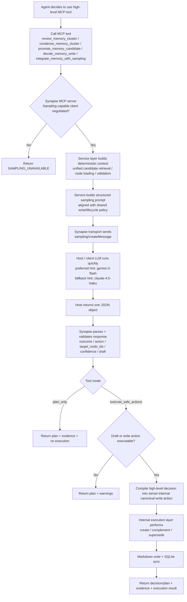

# Synapse Usage Guide

[Back to README](../README.md)

## Installation

```bash
python -m venv .venv
source .venv/bin/activate
pip install -e ".[dev]"
```

## Basic commands

```bash
python -m synapse version
python -m synapse status
python -m synapse rebuild-index
python -m synapse serve --run-server
python -m synapse mcp-proxy          # stdio proxy for VS Code
pytest
```

## Starting local inference with llama.cpp

Synapse requires two running inference servers — one for embedding, one for reranking.
[llama.cpp](https://github.com/ggml-org/llama.cpp) (`llama-server`) is the recommended local backend.

> **Why not Ollama?** Ollama exposes an embedding endpoint but has no rerank API.
> The reranker would silently fall back to a deterministic lexical scorer.

```bash
# embedding server
llama-server -m ~/models/bge-m3.gguf \
  --embeddings --port 47860 --host 127.0.0.1 &

# reranker server  (--rerank --pooling rank are required)
llama-server -m ~/models/bge-reranker-v2-m3.gguf \
  --rerank --pooling rank --port 47861 --host 127.0.0.1 &
```

Synapse calls both servers over HTTP. It does not start or manage them for you.
See the README for macOS launchd auto-start setup.

## Core workflows

### Public agent workflow

Synapse now centers the public interface on **one MCP-native workflow**.

Agents interact with Synapse through:

- retrieval and inspection tools such as `search_memory` and `get_node`
- high-level sampling-backed write and lifecycle tools
- a server-internal canonical execution layer that Synapse uses behind the scenes after a decision has been validated

In other words, the calling agent no longer chooses between multiple public orchestration styles. The public story is simple:

1. search or inspect memory
2. call a high-level MCP tool when a semantic write or lifecycle decision is needed
3. let Synapse gather deterministic context, request a structured sampling decision from the host, validate it, and execute the write path safely

## Default public MCP tool surface

By default, Synapse exposes only the high-level closed-loop MCP tools needed for retrieval, inspection, and high-level write/lifecycle actions:

- `search_memory`
- `get_node`
- `decide_memory_write`
- `integrate_memory_with_sampling`
- `review_memory_cluster`
- `condense_memory_cluster`
- `promote_memory_candidate`

Lower-level MCP write helpers such as `integrate_knowledge`, `search_existing_nodes`, and `update_node_status` remain internal by default even though they still exist as implementation-layer capabilities.

Repository skill files such as `memory-write` and `memory-lifecycle` may still exist in the repo, but they are now treated as policy/reference material only. They are not the public runtime path and should not be presented as parallel agent workflows.

## Running the MCP surface

What to configure:

- normal Synapse retrieval / embedding / reranker settings in `config.toml`
- a compatible MCP host/client that advertises the `sampling` capability
- optional `auth_token` protection if you expose the server beyond localhost

Default model hints used by Synapse for sampling-backed tools are optimized for speed:

- `gemini-3-flash`
- `claude-4.5-haiku`

What you do **not** configure in Synapse today:

- there is currently **no separate `[sampling]` section** in `config.toml`
- sampling is negotiated at MCP session setup time by the client/host, not by a static Synapse config flag
- there is no CLI transport selector anymore; the public surface is intentionally converging on one server runtime

Minimal setup:

1. configure Synapse normally in `config.toml`
2. start Synapse with `python -m synapse serve --run-server`
3. connect from an MCP client that advertises `sampling`
4. call high-level tools such as `integrate_memory_with_sampling` or `decide_memory_write`

### VS Code integration via stdio proxy

VS Code's MCP client does not yet support sampling over Streamable HTTP. Synapse provides a **stdio-to-HTTP proxy** that bridges the gap:

```bash
python -m synapse mcp-proxy [--url http://host:port/mcp]
```

VS Code `mcp.json` configuration:

```json
{
  "servers": {
    "synapse": {
      "type": "stdio",
      "command": "uv",
      "args": ["run", "python", "-m", "synapse", "mcp-proxy"],
      "cwd": "/path/to/Synapse"
    }
  }
}
```

The proxy forwards all JSON-RPC messages to the running Synapse HTTP server and relays SSE-based `sampling/createMessage` callbacks through stdout, so VS Code can invoke its model picker for sampling-backed tools.

## End-to-end flow when using MCP sampling



### Rebuild the index

Use this when:

- you added or changed many Markdown files outside the sync loop
- you changed embedding settings
- you want to recover the SQLite index from source Markdown

```bash
python -m synapse rebuild-index
```

### Start the server

Startup checks only:

```bash
python -m synapse serve
```

Startup checks plus the server runtime:

```bash
python -m synapse serve --run-server
```

## Lifecycle commands

### Run the janitor

```bash
python -m synapse janitor
```

This can:

- archive stale orphan nodes
- archive safely superseded nodes
- warn about disputed knowledge backlog
- purge expired archive files

### Run archive condensation

```bash
python -m synapse condense
```

This synthesizes recent archive backlog into a new active memory node while preserving original archive notes.

## Service management

Install as a background service:

```bash
python -m synapse install --service
```

Uninstall:

```bash
python -m synapse uninstall --service
```

Restart:

```bash
python -m synapse restart
```

View service logs:

```bash
python -m synapse logs --lines 50
```

## MCP server surface

The server side supports operations such as:

- search memory
- high-level sampling-backed memory and lifecycle tools when the MCP client supports sampling
- get nodes
- health and stats

The default public MCP surface is intentionally narrower than the full internal execution layer, and the public write/lifecycle story is intentionally limited to the high-level sampling-backed tools listed above.

## Troubleshooting quick list

### `status` fails

Common causes:

- dependencies not installed in the selected interpreter
- running outside the project environment
- config path mismatch

### embeddings unavailable

Check:

- `llama-server` processes are running on the configured ports
- the model files exist at the paths provided to `llama-server`
- the provider and dimension match your config

### service logs are missing

This usually means the daemon has not been installed or started yet.

### index issues

Rebuild from source Markdown:

```bash
python -m synapse rebuild-index
```
