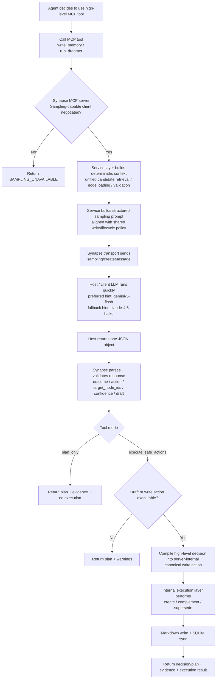

# Synapse Usage Guide

[Back to README](../README.md)

## Installation

```bash
python -m venv .venv
source .venv/bin/activate
pip install -e ".[dev]"
```

## Basic commands

```bash
python -m synapse version
python -m synapse status
python -m synapse rebuild-index
python -m synapse dedupe-session-summaries
python -m synapse serve --run-server
pytest
```

## Starting local inference with llama.cpp

Synapse requires two running inference servers — one for embedding, one for reranking.
[llama.cpp](https://github.com/ggml-org/llama.cpp) (`llama-server`) is the recommended local backend.

> **Why not Ollama?** Ollama exposes an embedding endpoint but has no rerank API.
> The reranker would silently fall back to a deterministic lexical scorer.

```bash
# embedding server
llama-server -m ~/models/bge-m3.gguf \
  --embeddings --port 47860 --host 127.0.0.1 &

# reranker server  (--rerank --pooling rank are required)
llama-server -m ~/models/bge-reranker-v2-m3.gguf \
  --rerank --pooling rank --port 47861 --host 127.0.0.1 &
```

Synapse calls both servers over HTTP. It does not start or manage them for you.
See the README for macOS launchd auto-start setup.

## Core workflows

### Public agent workflow

Synapse now centers the public interface on **one MCP-native workflow**.

Agents interact with Synapse through:

- retrieval and inspection tools such as `search_memory`
- high-level sampling-backed write and lifecycle tools
- a server-internal canonical execution layer that Synapse uses behind the scenes after a decision has been validated

In other words, the calling agent no longer chooses between multiple public orchestration styles. The public story is simple:

1. search or inspect memory
2. call a high-level MCP tool when a semantic write or lifecycle decision is needed
3. let Synapse gather deterministic context, request a structured sampling decision from the host, validate it, and execute the write path safely

## Default public MCP tool surface

By default, Synapse exposes three high-level MCP tools:

- `search_memory` — hybrid retrieval over active memory (returns full node objects)
- `write_memory` — sampling-backed write decision + execution
- `run_dreamer` — lifecycle maintenance (stale cleanup, superseded archival, disputed review, missing link suggestions, archive condensation)

Lower-level execution primitives exist internally but are not part of the public agent contract.

## Running the MCP surface

What to configure:

- normal Synapse retrieval / embedding / reranker settings in `config.toml`
- a compatible MCP host/client that advertises the `sampling` capability
- optional `auth_token` protection if you expose the server beyond localhost

Default model hints used by Synapse for sampling-backed tools are optimized for speed:

- `gemini-3-flash`
- `claude-4.5-haiku`

What you do **not** configure in Synapse today:

- there is currently **no separate `[sampling]` section** in `config.toml`
- sampling is negotiated at MCP session setup time by the client/host, not by a static Synapse config flag
- there is no CLI transport selector anymore; the public surface is intentionally converging on one server runtime

Minimal setup:

1. configure Synapse normally in `config.toml`
2. start Synapse with `python -m synapse serve --run-server`
3. connect from an MCP client that advertises `sampling`
4. call high-level tools such as `write_memory`

## End-to-end flow when using MCP sampling


```mermaid
flowchart TD
  A[Agent decides to use high-level MCP tool] --> B[Call MCP tool\nwrite_memory / run_dreamer]
  B --> C{Synapse MCP server\nSampling-capable client negotiated?}
  C -- No --> C1[Return SAMPLING_UNAVAILABLE]
  C -- Yes --> D[Service layer builds deterministic context\nunified candidate retrieval / node loading / validation]
  D --> E[Service builds structured sampling prompt\naligned with shared write/lifecycle policy]
  E --> F[Synapse transport sends\nsampling/createMessage]
  F --> G[Host / client LLM runs quickly\npreferred hint: gemini-3-flash\nfallback hint: claude-4.5-haiku]
  G --> H[Host returns one JSON object]
  H --> I[Synapse parses + validates response\noutcome / action / target_node_ids / confidence / draft]
  I --> J{Tool mode}
  J -- plan_only --> K[Return plan + evidence + no execution]
  J -- execute_safe_actions --> L{Draft or write action executable?}
  L -- No --> M[Return plan + warnings]
  L -- Yes --> N[Compile high-level decision into server-internal canonical write action]
  N --> O[Internal execution layer performs\ncreate / complement / supersede]
  O --> P[Markdown write + SQLite sync]
  P --> Q[Return decision/plan + evidence + execution result]
```

### Rebuild the index

Use this when:

- you added or changed many Markdown files outside the sync loop
- you changed embedding settings
- you want to recover the SQLite index from source Markdown

```bash
python -m synapse rebuild-index
```

### Start the server

Startup checks only:

```bash
python -m synapse serve
```

Startup checks plus the server runtime:

```bash
python -m synapse serve --run-server
```

## REST API

When the server runs (`serve --run-server`), two REST endpoints are available alongside MCP:

### POST /api/search

```json
{"query": "...", "top_k": 3, "exclude_session_key": "..."}
```

`exclude_session_key` is optional: the node derived from that session key is removed from the results and candidates.

#### How search scores results (Phase 1)

The pipeline fuses three signals, then reranks and applies sign-safe additive penalties:

1. **Lexical leg** — FTS5 with **OR semantics** (an implicit AND made multi-word queries miss). Chinese runs are expanded to **overlapping bigrams** in a shadow index (`nodes_fts_bigram`, maintained on every upsert and rebuilt automatically on schema migration), so unsegmented Chinese like `记忆库` matches without an exact character run. English words and code identifiers (`nodes_vec`, `sqlite.py`) pass through unchanged.
2. **Dense leg** — bge-m3 embeddings. Long multi-part recall queries (the bridge joins the last 3 user messages with `\n---\n`) are **additionally embedded per message** and fused with **max-fusion** (each candidate keeps its best per-list rank) so one specific rank-1 match is not drowned by transcripts that appear in every list.
3. **Reranker** — the full fused top-`[reranker] max_candidates` (default 9) is reranked; graph-hop neighbours only **append** when slots remain, they never displace fused hits.

Final score = raw reranker logit + `ln` of decay/status multipliers (additive in logit space, so a stale or superseded irrelevant result can never be multiplied *up* toward 0):

- **Persistent knowledge** gets a fixed small penalty (`-0.2`) regardless of access age — knowledge is not punished for not being accessed recently.
- **Transient material** decays additively by `ln(0.98^days-since-access)`.
- **Superseded** nodes get `ln(0.1)`, **disputed** `ln(0.5)` — strictly below active nodes at equal relevance.

Each result carries an **`inject` flag** (server-side injection decision, plus the raw `rerank_logit`). A result is injectable when its raw reranker logit clears `[retrieval] inject_logit_floor` (default `0.25`) **and** its logit is within `[retrieval] inject_relative_margin` (default `2.5`) of the query's best logit. Long multi-message recall queries depress absolute logits while relative ordering stays correct, so the relative margin trims far-below-best noise; persistent nodes compare their pre-penalty logit (`inject_ignore_persistent_penalty`, default `true`). Clients (the omp bridge) inject only `inject: true` results; `score` semantics are unchanged (it may be negative for correctly-ranked results, so `score > 0` is **no longer** the recommended injection gate).

Excluded nodes (**distilled-current transcripts** — represented or zero-item, i.e. already contributed whatever the LLM judged durable — and `exclude_session_key`) are filtered **before** fusion, so they cannot consume fused candidate slots; only not-yet-distilled transcripts remain searchable by default (`include=transcripts|all` returns everything).

### POST /api/write

Without `session_key`, the write goes through the sampling-backed decider (LLM). If an ACTIVE node with the same title and byte-identical content already exists, it is returned as `unchanged` without calling the LLM.

**Type defaulting (write-path tightening):** `type` is optional. An explicit `type` always wins. When omitted, the write defaults to **persistent** and is normalized into OKF: a body matching an OKF template gets its `okf_type` inferred deterministically (Symptom+Cause+Fix → `pitfall`, Steps → `procedure`, Context+Decision+Consequences → `decision`, Details → `fact`); otherwise the note is reshaped into ONE OKF item by the LLM with the original text preserved under `## Original note` (fidelity guard). On LLM failure an omitted-type write falls back to transient, stored as submitted. Non-English titles get the same one-shot English repair the distiller uses. `sources` stays optional; when absent the node just gets a validation warning — no pseudo-sources are invented.

With an optional `session_key`, the write is a deterministic keyed upsert — no LLM involved:

```json
{"session_key": "omp-session-123", "title": "Session summary — x", "content": "...", "type": "transient"}
```

- node id is derived from the key (`mem_session_<16 hex of sha1(key)>`), so repeated writes for the same session converge on one node
- absent → `created`; identical title+content → `unchanged`; different → `updated` in place (markdown + index + re-embed)
- concurrent same-key writes serialize; concurrent identical unkeyed writes are guarded (exactly one node)

`## Related` sections are merged, never duplicated: complement/supersede links extend the existing trailing `## Related` block with deduplicated `[[id]]` bullets (historical duplicates can be normalized with `SynapseServerService.merge_related_sections`).

#### Evaluation harness

Golden-set evaluation runs the real retrieval pipeline against whatever DB the config points at:

```sh
python -m synapse eval --golden <path-to-golden.json> [--report out.json] [--history history.jsonl] [--top-k 5] [--runs 1]
```

`--history` appends one JSON line per run to a JSONL file (default `~/.synapse/eval/history.jsonl`): `{ts, git_sha, golden_sha256, n_queries, overall, slices, stale_labels, queries_without_labels}`. Label drift against live data is handled before scoring: superseded labels follow `superseded_by` to the terminal active node, archived/missing labels are dropped and counted in `stale_labels`, and queries whose labels are all stale are reported in `queries_without_labels` rather than scored as misses.

Metrics: Recall@5 / MRR@10 (raw and among `score > 0` results — the bridge's injection criterion), top-1 relevance, lexical zero-hit rate, positive-score rate, false-injection rate on no-memory queries, p50/p95 latency — overall and per language slice (`zh` / `en` / `mixed` / `code` / `recall` / `none`). `synapse/eval/golden.example.json` is a synthetic example; real golden sets with actual queries/node ids belong **outside** the repo (e.g. `~/.synapse/eval/`).

#### Weekly scheduled eval (launchd)

Create `~/Library/LaunchAgents/com.synapse.eval.plist` (fill the placeholders; expand `~` to absolute paths — launchd does not):

```xml
<?xml version="1.0" encoding="UTF-8"?>
<!DOCTYPE plist PUBLIC "-//Apple//DTD PLIST 1.0//EN" "http://www.apple.com/DTDs/PropertyList-1.0.dtd">
<plist version="1.0">
<dict>
  <key>Label</key><string>com.synapse.eval</string>
  <key>ProgramArguments</key>
  <array>
    <string>/bin/sh</string>
    <string><REPO>/scripts/eval_launch.sh</string>
  </array>
  <key>StartCalendarInterval</key>
  <dict>
    <key>Weekday</key><integer>1</integer>
    <key>Hour</key><integer>10</integer>
    <key>Minute</key><integer>0</integer>
  </dict>
  <key>EnvironmentVariables</key>
  <dict>
    <key>SYNAPSE_CONFIG_PATH</key><string>/Users/<you>/.synapse/config.local.toml</string>
  </dict>
  <key>WorkingDirectory</key><string><REPO></string>
  <key>StandardOutPath</key><string>/Users/<you>/.synapse/.logs/eval-job.log</string>
  <key>StandardErrorPath</key><string>/Users/<you>/.synapse/.logs/eval-job.log</string>
</dict>
</plist>
```

The wrapper computes the date-stamped report path:

```sh
#!/bin/sh
# scripts/eval_launch.sh — launchd entrypoint for the weekly eval
set -eu
REPO="$(cd "$(dirname "$0")/.." && pwd)"
LOGDIR="${HOME}/.synapse/eval/reports"
mkdir -p "${LOGDIR}" "${HOME}/.synapse/.logs"
exec "${REPO}/.venv/bin/python" -m synapse eval \
  --golden "${HOME}/.synapse/eval/golden-v1.json" \
  --history "${HOME}/.synapse/eval/history.jsonl" \
  --report "${LOGDIR}/$(date +%F).json"
```

Load and trigger manually: `launchctl bootstrap gui/$(id -u) ~/Library/LaunchAgents/com.synapse.eval.plist`, then `launchctl kickstart gui/$(id -u)/com.synapse.eval`. Remove with `bootout` when no longer wanted.

## Observability (usage analytics & lookback)

Every search and write is recorded locally (SQLite tables `search_events`, `write_memory_events.route`, `metrics_snapshots` — schema v7) so the owner can look back after 1–2 months and decide the next upgrade direction. All data stays on the machine; query text is stored in the private local DB only. Full key reference: `docs/configuration.md` § `[observability]`.

- **Search events** — one row per `search_memory` call with `source` (`bridge` / `rest` / `mcp`), session hash, query text, CJK ratio, latency, and per-result `inject` decisions. Eval runs bypass the service layer and are never recorded (usage statistics stay eval-free). Rows older than `search_events_retention_days` (default 180) are pruned on write.
- **Daily snapshots** — written automatically after each distiller sweep (idempotent per local day, 2-day backfill when the machine slept); `python -m synapse metrics snapshot` runs/prints one manually.
- **Write attribution** — `write_memory_events.route` distinguishes `mcp`, `rest`, `session_upsert`, `distiller`, `write_node`; the dedupe-guard `unchanged` path is now recorded too.

Lookback commands:

```sh
python -m synapse report --since 30d --out lookback.md   # markdown summary (weekly buckets, inject rates, growth, eval trend)
python -m synapse audit injections --since 30d --sample 30 --report audit.md   # LLM-judged injection precision
python -m synapse metrics snapshot                        # today's raw metrics JSON
```

The injection audit samples `inject=true` results from bridge/mcp searches, asks the configured `[decider]` LLM to grade relevance (0 irrelevant / 1 related / 2 directly useful), reports precision with a Wilson 95% interval (per source, per okf_type), lists the worst cases, and appends to `~/.synapse/eval/audit-history.jsonl`. On macOS, `ServiceManager(config).install_audit_launchd()` generates `~/Library/LaunchAgents/com.synapse.audit.plist` (monthly, day 1 at 10:00); see `docs/configuration.md` for the exact steps.

## Lifecycle

Lifecycle maintenance — stale orphan eviction, superseded archival, disputed review, missing link discovery, and archive condensation — is handled by the `run_dreamer` MCP tool.

Superseded archival resolves the `superseded_by` chain to its terminal node: a node is archived when the terminal is ACTIVE with a file on disk, when the terminal is missing from the index (already archived or deleted), or when `superseded_by` is missing entirely. Nodes whose terminal is DISPUTED (live disagreement) or whose chain is cyclic are kept.

## OKF knowledge format & the session distiller

Knowledge nodes follow **OKF** (see `docs/okf.md` for the authoritative spec): typed templates
(`decision` / `fact` / `procedure` / `pitfall`) with fixed English `##` section headings, a one-line
`## Takeaway`, and a `## Sources` provenance section. Body content may be Chinese, English, or mixed.
Every OKF node carries `okf_type`, `okf_version`, and `sources` frontmatter.

The **session distiller** converts session transcript nodes into OKF knowledge automatically:

- a sweep runs every `distiller.interval_minutes` (default 10) when `[distiller] enabled = true`,
  selecting idle transcripts (`idle_minutes`, default 30) whose content changed since last distillation;
- **both the idle clock and the retention clock use the transcript file's mtime** — stamping
  (`distilled_hash` write-back) and failure backoff rewrite the file, so they reset the clock;
  this is intentional: a stamp means "this transcript was just processed", and retention counts
  from the last real content update;
- extracted items are written through the normal `write_memory` decider path as `persistent` nodes
  with provenance (`sources` + backlink on the transcript's `distilled_node_ids`);
- fully-distilled transcripts are excluded from default search (`include=all` restores them) and
  archived after `distiller.retention_days` (default 45) — **never before they are distilled**;
- distilled items can complement existing knowledge but never supersede curated nodes by default
  in backfill mode (`downgrade_supersede`).

Maintenance commands:

```bash
python -m synapse distill status                  # queue depth + recent run metrics
python -m synapse distill run --dry-run           # plan only, no writes
python -m synapse distill run --apply --limit 5   # sweep up to 5 transcripts
python -m synapse distill run --id <node-id>      # distill one transcript
python -m synapse distill run --legacy-groups groups.json --report out.json   # backfill mode
```

## Maintenance commands

Archive duplicate/stale session summaries (`Session summary — %` titles): exact duplicates keep the newest copy, prefix-subsumed older versions are archived, and stale superseded nodes are cleaned up. Dry-run by default:

```bash
python -m synapse dedupe-session-summaries
```

Execute (writes a JSON manifest of archived ids + original paths into `.archive/` for reversibility):

```bash
python -m synapse dedupe-session-summaries --apply
```

## Service management

Install as a background service:

```bash
python -m synapse install --service
```

Uninstall:

```bash
python -m synapse uninstall --service
```

Restart:

```bash
python -m synapse restart
```

View service logs:

```bash
python -m synapse logs --lines 50
```

## MCP server surface

The server side supports operations such as:

- search memory
- high-level sampling-backed memory and lifecycle tools when the MCP client supports sampling
- get nodes
- health and stats

The default public MCP surface is intentionally narrower than the full internal execution layer, and the public write/lifecycle story is intentionally limited to the high-level sampling-backed tools listed above.

## Troubleshooting quick list

### `status` fails

Common causes:

- dependencies not installed in the selected interpreter
- running outside the project environment
- config path mismatch

### embeddings unavailable

Check:

- `llama-server` processes are running on the configured ports
- the model files exist at the paths provided to `llama-server`
- the provider and dimension match your config

### service logs are missing

This usually means the daemon has not been installed or started yet.

### where logs live

- `synapse.log`, `mcp-daemon.log`, `file-watcher.log`, `audit.log` — rotating JSON logs in `[logging] log_dir` (default `.synapse/.logs`).
- `uvicorn.log` — server/app log (uvicorn default + error records), rotating, same `[logging]` limits; error-level records are also mirrored to stderr so launchd still captures crashes in `service-error.log`.
- `uvicorn-access.log` — HTTP access log, rotating, same `[logging]` limits; access lines no longer go to stdout/stderr.
- `service.log` / `service-error.log` — raw launchd capture of the service's stdout/stderr (not rotated; should now stay near-empty since uvicorn logs are routed to files).

### index issues

Rebuild from source Markdown:

```bash
python -m synapse rebuild-index
```
