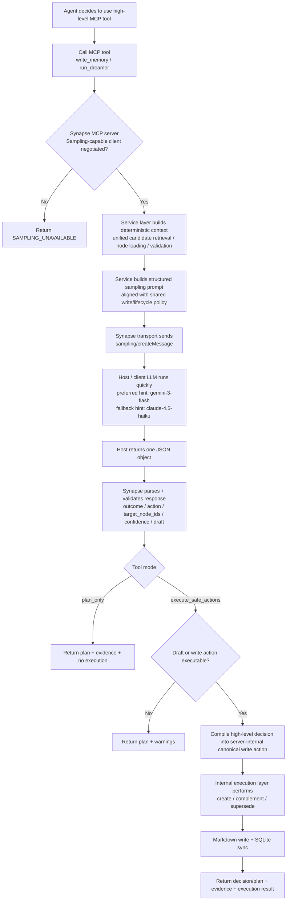

# Synapse Usage Guide

[Back to README](../README.md)

## Installation

```bash
python -m venv .venv
source .venv/bin/activate
pip install -e ".[dev]"
```

## Basic commands

```bash
python -m synapse version
python -m synapse status
python -m synapse rebuild-index
python -m synapse dedupe-session-summaries
python -m synapse serve --run-server
pytest
```

## Starting local inference with llama.cpp

Synapse requires two running inference servers — one for embedding, one for reranking.
[llama.cpp](https://github.com/ggml-org/llama.cpp) (`llama-server`) is the recommended local backend.

> **Why not Ollama?** Ollama exposes an embedding endpoint but has no rerank API.
> The reranker would silently fall back to a deterministic lexical scorer.

```bash
# embedding server
llama-server -m ~/models/bge-m3.gguf \
  --embeddings --port 47860 --host 127.0.0.1 &

# reranker server  (--rerank --pooling rank are required)
llama-server -m ~/models/bge-reranker-v2-m3.gguf \
  --rerank --pooling rank --port 47861 --host 127.0.0.1 &
```

Synapse calls both servers over HTTP. It does not start or manage them for you.
See the README for macOS launchd auto-start setup.

## Core workflows

### Public agent workflow

Synapse now centers the public interface on **one MCP-native workflow**.

Agents interact with Synapse through:

- retrieval and inspection tools such as `search_memory`
- high-level sampling-backed write and lifecycle tools
- a server-internal canonical execution layer that Synapse uses behind the scenes after a decision has been validated

In other words, the calling agent no longer chooses between multiple public orchestration styles. The public story is simple:

1. search or inspect memory
2. call a high-level MCP tool when a semantic write or lifecycle decision is needed
3. let Synapse gather deterministic context, request a structured sampling decision from the host, validate it, and execute the write path safely

## Default public MCP tool surface

By default, Synapse exposes three high-level MCP tools:

- `search_memory` — hybrid retrieval over active memory (returns full node objects)
- `write_memory` — sampling-backed write decision + execution
- `run_dreamer` — lifecycle maintenance (stale cleanup, superseded archival, disputed review, missing link suggestions, archive condensation)

Lower-level execution primitives exist internally but are not part of the public agent contract.

## Running the MCP surface

What to configure:

- normal Synapse retrieval / embedding / reranker settings in `config.toml`
- a compatible MCP host/client that advertises the `sampling` capability
- optional `auth_token` protection if you expose the server beyond localhost

Default model hints used by Synapse for sampling-backed tools are optimized for speed:

- `gemini-3-flash`
- `claude-4.5-haiku`

What you do **not** configure in Synapse today:

- there is currently **no separate `[sampling]` section** in `config.toml`
- sampling is negotiated at MCP session setup time by the client/host, not by a static Synapse config flag
- there is no CLI transport selector anymore; the public surface is intentionally converging on one server runtime

Minimal setup:

1. configure Synapse normally in `config.toml`
2. start Synapse with `python -m synapse serve --run-server`
3. connect from an MCP client that advertises `sampling`
4. call high-level tools such as `write_memory`

## End-to-end flow when using MCP sampling


```mermaid
flowchart TD
  A[Agent decides to use high-level MCP tool] --> B[Call MCP tool\nwrite_memory / run_dreamer]
  B --> C{Synapse MCP server\nSampling-capable client negotiated?}
  C -- No --> C1[Return SAMPLING_UNAVAILABLE]
  C -- Yes --> D[Service layer builds deterministic context\nunified candidate retrieval / node loading / validation]
  D --> E[Service builds structured sampling prompt\naligned with shared write/lifecycle policy]
  E --> F[Synapse transport sends\nsampling/createMessage]
  F --> G[Host / client LLM runs quickly\npreferred hint: gemini-3-flash\nfallback hint: claude-4.5-haiku]
  G --> H[Host returns one JSON object]
  H --> I[Synapse parses + validates response\noutcome / action / target_node_ids / confidence / draft]
  I --> J{Tool mode}
  J -- plan_only --> K[Return plan + evidence + no execution]
  J -- execute_safe_actions --> L{Draft or write action executable?}
  L -- No --> M[Return plan + warnings]
  L -- Yes --> N[Compile high-level decision into server-internal canonical write action]
  N --> O[Internal execution layer performs\ncreate / complement / supersede]
  O --> P[Markdown write + SQLite sync]
  P --> Q[Return decision/plan + evidence + execution result]
```

### Rebuild the index

Use this when:

- you added or changed many Markdown files outside the sync loop
- you changed embedding settings
- you want to recover the SQLite index from source Markdown

```bash
python -m synapse rebuild-index
```

### Start the server

Startup checks only:

```bash
python -m synapse serve
```

Startup checks plus the server runtime:

```bash
python -m synapse serve --run-server
```

## REST API

When the server runs (`serve --run-server`), two REST endpoints are available alongside MCP:

### POST /api/search

```json
{"query": "...", "top_k": 3, "exclude_session_key": "..."}
```

`exclude_session_key` is optional: the node derived from that session key is removed from the results and candidates.

### POST /api/write

Without `session_key`, the write goes through the sampling-backed decider (LLM). If an ACTIVE node with the same title and byte-identical content already exists, it is returned as `unchanged` without calling the LLM.

With an optional `session_key`, the write is a deterministic keyed upsert — no LLM involved:

```json
{"session_key": "omp-session-123", "title": "Session summary — x", "content": "...", "type": "transient"}
```

- node id is derived from the key (`mem_session_<16 hex of sha1(key)>`), so repeated writes for the same session converge on one node
- absent → `created`; identical title+content → `unchanged`; different → `updated` in place (markdown + index + re-embed)
- concurrent same-key writes serialize; concurrent identical unkeyed writes are guarded (exactly one node)

## Lifecycle

Lifecycle maintenance — stale orphan eviction, superseded archival, disputed review, missing link discovery, and archive condensation — is handled by the `run_dreamer` MCP tool.

Superseded archival resolves the `superseded_by` chain to its terminal node: a node is archived when the terminal is ACTIVE with a file on disk, when the terminal is missing from the index (already archived or deleted), or when `superseded_by` is missing entirely. Nodes whose terminal is DISPUTED (live disagreement) or whose chain is cyclic are kept.

## Maintenance commands

Archive duplicate/stale session summaries (`Session summary — %` titles): exact duplicates keep the newest copy, prefix-subsumed older versions are archived, and stale superseded nodes are cleaned up. Dry-run by default:

```bash
python -m synapse dedupe-session-summaries
```

Execute (writes a JSON manifest of archived ids + original paths into `.archive/` for reversibility):

```bash
python -m synapse dedupe-session-summaries --apply
```

## Service management

Install as a background service:

```bash
python -m synapse install --service
```

Uninstall:

```bash
python -m synapse uninstall --service
```

Restart:

```bash
python -m synapse restart
```

View service logs:

```bash
python -m synapse logs --lines 50
```

## MCP server surface

The server side supports operations such as:

- search memory
- high-level sampling-backed memory and lifecycle tools when the MCP client supports sampling
- get nodes
- health and stats

The default public MCP surface is intentionally narrower than the full internal execution layer, and the public write/lifecycle story is intentionally limited to the high-level sampling-backed tools listed above.

## Troubleshooting quick list

### `status` fails

Common causes:

- dependencies not installed in the selected interpreter
- running outside the project environment
- config path mismatch

### embeddings unavailable

Check:

- `llama-server` processes are running on the configured ports
- the model files exist at the paths provided to `llama-server`
- the provider and dimension match your config

### service logs are missing

This usually means the daemon has not been installed or started yet.

### index issues

Rebuild from source Markdown:

```bash
python -m synapse rebuild-index
```
